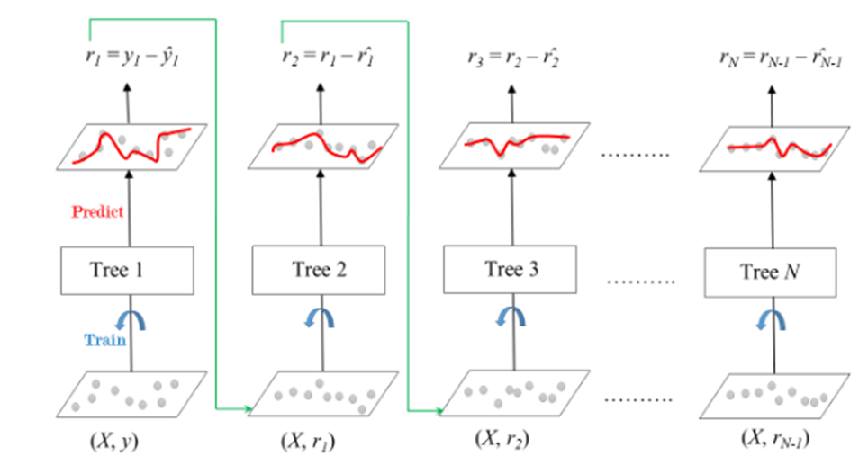

# Grandient Boosting
## 1. Giới thiệu
Gradient Boosting là một phương pháp học ensemble được dùng cho các bài toán phân loại và hồi quy. Đây là một thuật toán học tăng cường bằng cách tổ hợp nhiều mô hình để tạo ra mô hình dự đoán mạnh nhất. Thuật toán hoạt động dựa trên việc training tuần tự models, trong đó mỗi model sẽ cố gắng sửa các lỗi do ‘người tiền nhiệm’ trước đó thực hiện
Trong gradient boosting, mỗi mô hình mới được đào tạo để tối tiểu hoá hàm loss, chẳng hạng như MSE hay cross-entropy của model trước đó sử dụng gradient descent. Trong mỗi bước lặp cảu thuật toán sẽ tính toán gradient của hàm loss theo dự đoá và huấn luyện một mô hình yếu mới để giảm thiểu gradient này. Dụ đoán cảu mô hình mới sẽ được thêm vào ensemble (tất cả mô hình dự đoán)và quá trình được lặp đi lặp lại cho đến khi thoả mãn tiêu chí dừng
## 2. Shrinkage và Độ phức tạp model
Trong gradient boosting, thuật ngữ ‘Shrinkage’ liên quan đến việc sử dụng learning rate (\eta ). Chỉ số learning rate sẽ điều chỉnh mức độ ảnh hưởng của mỗi Decision Tree mới được thêm vào model trong quá trình training.
-	Với leaning rate thấp: có nghĩa là sự đóng góp của mỗi cây là nhỏ, điều này sẽ làm giảm rủi ro overfitting nhưng yêu cầu nhiều cây để đạt được hiệu suất tốt, dẫn đến thời gian trainning lâu hơn
-	Với learning rate cao: có nghĩa là mỗi Decision Tree có sự tác động lớn nhưng điều đó lại dẫn đến hiện tượng overfitting
Vì vậy việc lựa chọn learning rate phải có sự phù hợp để models cho ra hiệu suất tốt nhất.
## 3. Cách thức hoạt động
### 3.1Quá trình học tập tuần tự
Ensemble bao gồm nhiều cây được huấn luyện để sửa lỗi của cây trước đó. Trong lần lặp đầu tiên, Tree 1 sẽ được trained trên dữ liệu gốc x và true labels y. Nó sẽ đưa ra dự đoán, và dự đoán này sẽ được dùng để tính toán lỗi.
### 3.2 Tính toán phần dư (phần chênh lệch giữa label y gốc và label y’ dự đoán dựa trên model đã trained)
Trong bước lặp thứ 2, Tree 2 sẽ được huấn luyện dựa trên data gốc  x, thay vì nhãn gốc y thì lúc này phần dư r = y - y’, và tương tự như bước huấn luyện ở Tree1. Quá trình này sẽ tiếp tục cho tất cả các cây trong Ensemble. Mỗi cây được huấn luyện tiếp theo dùng để dự đoán lỗi của cây trước đó.
 
(Nguồn: https://www.geeksforgeeks.org/ml-gradient-boosting/)
### 3.3 Shrinkage 
Sau mỗi lần cây được huấn luyện, thì dự đoán mới của nó sẽ thu hẹp lại bằng cách nhân chúng với giá trị learning rate (giá trị này dao động từ 0 đến 1). Điều này giúp tránh hiện tượng overfitting bằng cách đảm bảo cho mỗi cây có sự tác động nhỏ hơn đến mô hình cuối cùng.
Sau khi tất cả các cây được trained, thì dự đoán ban đầu được thực hiện bằng các tổng hợp các đóng góp của tất cả các cây. Dự đoán cuối cùng được tính toán bởi công thức sau: 

với r1, r2 ... rN là các lỗi dự đoán của mỗi cây.

#Một số mô hình
# XGBoost (eXtrem Gradient Boosting)
Là một mô hình học máy nâng cao được thiết kế nhằm tăng tốc độ tính toán, hiệu quả và hiệu suất cao. Đây là một sự triển khai tối ưu hoá của Gradient Boosting.
-	XGBoost dùng cây quyết định như bộ học cơ sở và tổng hợp tuần tự kết quả để cải thiện hiệu suất mô hình. Cách hoạt động được mô tả như Gradient Boosting, đó là chúng sẽ sử dụng kết quả dự đoán lỗi trước đó để huấn luyện cho cây tiếp theo, và quá trình này được gọi là ‘boosting’.
-	Nó đã được xử lý song song tích hợp để huấn luyện mô hinh ftreen bộ dữ liệu lớn một cách nhanh chóng. XGBoost cũng hỗ trợ các tuỳ chỉnh cho phép user điều chỉnh các parameters để tối ưu hoá hiệu suất mô hình dựa trên từng bài toán khác nhau.
## 1. Cách XGBoost hoạt động
XGBoost xây dựng các cây quyết định một cách tuần tự với cách hoạt động cây phía sau sẽ cố gắng giảm sai số của cây phía trước, quá trình hoạt động có thể được tóm tắt như sau: 
-	Bắt đầu với cây đầu tiên: Mô hình cây quyết định đầu tiên sẽ huấn luyện trên dữ liệu ban đầu, và cho ra kết quả là dự đoán của trường target.
-	Tính toán lỗi: Sau khi có được dự đoán của trường target, giá trị lỗi được tính toán bằng lỗi giữa giá trị thực tế và giá trị dự đoán
-	Huấn luyện cho cây tiếp theo: Cây tiếp theo sẽ được huấn luyện với giá trị lỗi sai làm giá trị target. Bước này sẽ cố gắng sửa các lỗi được thực hiện ở cây trước đó
-	Quá trình lặp lại: Quá trình này sẽ được lặp lại bằng cách cây mới sẽ sử dụng giá trị lỗi ở cây trước và được sử dụng để huấn luyện ở cây hiện tại cho đến khi đáp ứng được tiêu chí dừng.
-	Kết hợp các dự đoán: Dự đoán cuối cùng là tổng hợp của các dự đoán của các cây trước đó
## 2. Một số đặc trưng làm cho thuật toán này ‘eXtreme’
XGBoost là mở rộng của Gradient Boosting bằng cách khái quá hoá các yếu tố trong hàm mục tiêu. Chính vì vậy nó giúp khái quá hoá là ngăn chặn yếu tố overfitting trong mô hình.
-	Ngăn chặn overfitting:
o	Giá trị learning rate điều khiển sự đóng góp của mỗi cây cho đến dự đoán cuối cùng
o	Giá trị learning rate thấp giúp model nhất quán và tốt hơn
o	XGBoost phát triẻn cây theo cấp độ
o	Tại mỗi cấp độ, nó sẽ kiểm tra xem một phân chia mới có cải thiện hàm mục tiêu không
o	Thực hiện cắt tỉa nếu mô hình không cải thiện, làm cho cây đơn giản hơn
o	Regularization, shrinking (learning rate) và cắt tỉa nhánh giúp tránh overfitting
o	Giúp cho mô hình cải thiện sự khái quát hoá và mạnh mẽ hơn
-	Cấu trúc cây:
Thông thường, cây quyết định thuồng phát triển cây tuần tự bằng cách mở rộng mỗi nhánh cho đến khi thoả mãn điều kiện dừng. Mặc khacs XGBoost xây dựng cây level-wise hay breadth-first. Điều này cho thấy rằng nó sẽ thêm nodes cho mỗi đặc trưng tại độ sâu cụ thể trước khi chuyển sang level tiếp theo, vì thế nó sẽ phát triển cây 1 bậc tại 1 thời điểm.
o	Xác định được vị trí nào tỉa nhánh tốt nhất: XGBoost đánh giá mọi phân chia có thể được thực hiện cho mọi đặc trưng tại mỗi cấp độ và chọn một đặc trưng để tối tiểu hoá hàm mục tiêu khả thi nhất có thể, giống như việc tính MSE cho bài toán regression hay cross-entropy  cho bài toán classification.
Ngược lại, một thuộc tính sẽ được lựa chọn để phân chịa tại mỗi bậc của mở rộng theo chiều sâu
o	Ưu tiên các thuộc tính quan trọng: Chi phí liên quân đến việt lựa chọn tỉa tốt nhất cho mỗi đặc trưng tại mỗi bâcj sễ bị giảm do sự phát triển level-wise. XGBoost loại bỏ sự cần thiết để xem lại và đánh giá cùng đặc tính nhiều lần trong quá trình xây dựng tất cả các cây vì tất cả các đặc tính đều được tính đến trong cùng một lúc.
-	Xử lý dữ liệu thiếu:
o	XGBoost xử lý dữ liệu trống hiệu quả trong quá trình huấn luyện 
o	Sử dụng thuật toán tìm kiếm phân tách thưa (Sparsity Aware Split Finding algorithm)
o	Xem các giá trị thiếu là một danh mục riêng biệt trong quá trình phân chia
o	Đối với dự đoán nếu một đặc trưng bị thiếu, thì sẽ xem xét tuân theo nhánh mặc định, điều này đảm bảo cho việc dự đoán mạnh mẽ nếu bộ dữ liệu bị thiếu
-	Xấp xỉ thuật toán tham lam
o	Sử dụng các quantiles có trọng số để tìm ra sự phân chia tối ưu một cách nhanh  chóng
o	Tránh kiểm tra chi tiết các phân chia khả thi
o	Xấp xỉ phân chia tốt nhất để cải thiện tốc độ và khả năng mở rộng
o	Lý tưởng cho các bộ dữ liệu lớn nơi đánh giá phân chia đầy đủ là tốn kém
o	Giảm chi phí tính toán, khi vẫn duy trì độ chính xác
## 3. Các tham số quan trọng trong XGBoost
Trong quá trình sử dụng mô hình, ta sẽ có các tham số trong mô hình như sau:
-	Learning rate (\eta): là một biến quan trnojg trong sửa đổi mức độ mỗi cây đóng góp vào dự đoán cuối cùng. Mặc dù cần nhiều cây hơn, các giá trị nhỏ thường cho mô hình chính xác hơn.
-	Max Depth: Tham số này kiểm soát độ sâu của mỗi cây, giúp tránh hiện tượng overfitting và là yếu tố quan trọng trong việc kiểm soát độ phức tạp của mô hình. 
-	Gamma: Dựa trên sự giảm thiểu mất mát, tham số này quyết định khi nào một nút trong cây sẽ được chia. Thuật toán trở nên nhất quán hơn với giá trị Gamma cao, do đó tránh các lần chia không làm giảm mất mát. Nó giúp quản lý độ phức tạp của cây. 
-	Subsample: Quản lý phần trăm dữ liệu được lấy ngẫu nhiên để phát triển mỗi cây, từ đó giảm phương sai và tăng cường khả năng tổng quát hóa. Thiết lập giá trị quá thấp có thể dẫn đến hiện tượng underfitting. 
-	Colsample Bytree: Xác định phần trăm đặc trưng (features) được lấy ngẫu nhiên để phát triển mỗi cây. 
-	n_estimators: Chỉ định số vòng boosting. 
-	alpha (khái niệm L1 regularization) và lambda (khái niệm L2 regularization): Kiểm soát mức độ mạnh mẽ của điều chuẩn L1 và L2 tương ứng. Giá trị cao hơn dẫn đến điều chuẩn mạnh hơn. 
-	min_child_weight: Ảnh hưởng đến cấu trúc cây bằng cách kiểm soát lượng dữ liệu tối thiểu cần thiết để tạo một nút mới. 
-	scale_pos_weight: Hữu ích trong các kịch bản lớp mất cân bằng để kiểm soát sự cân bằng giữa trọng số dương và âm.
