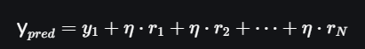

# Grandient Boosting
## 1. Giới thiệu
Gradient Boosting là một phương pháp học ensemble được dùng cho các bài toán phân loại và hồi quy. Đây là một thuật toán học tăng cường bằng cách tổ hợp nhiều mô hình để tạo ra mô hình dự đoán mạnh nhất. Thuật toán hoạt động dựa trên việc training tuần tự models, trong đó mỗi model sẽ cố gắng sửa các lỗi do ‘người tiền nhiệm’ trước đó thực hiện
Trong gradient boosting, mỗi mô hình mới được đào tạo để tối tiểu hoá hàm loss, chẳng hạng như MSE hay cross-entropy của model trước đó sử dụng gradient descent. Trong mỗi bước lặp cảu thuật toán sẽ tính toán gradient của hàm loss theo dự đoá và huấn luyện một mô hình yếu mới để giảm thiểu gradient này. Dụ đoán cảu mô hình mới sẽ được thêm vào ensemble (tất cả mô hình dự đoán)và quá trình được lặp đi lặp lại cho đến khi thoả mãn tiêu chí dừng
## 2. Shrinkage và Độ phức tạp model
Trong gradient boosting, thuật ngữ ‘Shrinkage’ liên quan đến việc sử dụng learning rate (\eta ). Chỉ số learning rate sẽ điều chỉnh mức độ ảnh hưởng của mỗi Decision Tree mới được thêm vào model trong quá trình training.
-	Với leaning rate thấp: có nghĩa là sự đóng góp của mỗi cây là nhỏ, điều này sẽ làm giảm rủi ro overfitting nhưng yêu cầu nhiều cây để đạt được hiệu suất tốt, dẫn đến thời gian trainning lâu hơn
-	Với learning rate cao: có nghĩa là mỗi Decision Tree có sự tác động lớn nhưng điều đó lại dẫn đến hiện tượng overfitting
Vì vậy việc lựa chọn learning rate phải có sự phù hợp để models cho ra hiệu suất tốt nhất.
## 3. Cách thức hoạt động
### 3.1Quá trình học tập tuần tự
Ensemble bao gồm nhiều cây được huấn luyện để sửa lỗi của cây trước đó. Trong lần lặp đầu tiên, Tree 1 sẽ được trained trên dữ liệu gốc x và true labels y. Nó sẽ đưa ra dự đoán, và dự đoán này sẽ được dùng để tính toán lỗi.
### 3.2 Tính toán phần dư (phần chênh lệch giữa label y gốc và label y’ dự đoán dựa trên model đã trained)
Trong bước lặp thứ 2, Tree 2 sẽ được huấn luyện dựa trên data gốc  x, thay vì nhãn gốc y thì lúc này phần dư r = y - y’, và tương tự như bước huấn luyện ở Tree1. Quá trình này sẽ tiếp tục cho tất cả các cây trong Ensemble. Mỗi cây được huấn luyện tiếp theo dùng để dự đoán lỗi của cây trước đó.
 
(Nguồn: https://www.geeksforgeeks.org/ml-gradient-boosting/)
### 3.3 Shrinkage 
Sau mỗi lần cây được huấn luyện, thì dự đoán mới của nó sẽ thu hẹp lại bằng cách nhân chúng với giá trị learning rate (giá trị này dao động từ 0 đến 1). Điều này giúp tránh hiện tượng overfitting bằng cách đảm bảo cho mỗi cây có sự tác động nhỏ hơn đến mô hình cuối cùng.
Sau khi tất cả các cây được trained, thì dự đoán ban đầu được thực hiện bằng các tổng hợp các đóng góp của tất cả các cây. Dự đoán cuối cùng được tính toán bởi công thức sau: 

với r1, r2 ... rN là các lỗi dự đoán của mỗi cây.

#Một số mô hình
# XGBoost (eXtrem Gradient Boosting)
Là một mô hình học máy nâng cao được thiết kế nhằm tăng tốc độ tính toán, hiệu quả và hiệu suất cao. Đây là một sự triển khai tối ưu hoá của Gradient Boosting.
-	XGBoost dùng cây quyết định như bộ học cơ sở và tổng hợp tuần tự kết quả để cải thiện hiệu suất mô hình. Cách hoạt động được mô tả như Gradient Boosting, đó là chúng sẽ sử dụng kết quả dự đoán lỗi trước đó để huấn luyện cho cây tiếp theo, và quá trình này được gọi là ‘boosting’.
-	Nó đã được xử lý song song tích hợp để huấn luyện mô hinh ftreen bộ dữ liệu lớn một cách nhanh chóng. XGBoost cũng hỗ trợ các tuỳ chỉnh cho phép user điều chỉnh các parameters để tối ưu hoá hiệu suất mô hình dựa trên từng bài toán khác nhau.
## 1. Cách XGBoost hoạt động
XGBoost xây dựng các cây quyết định một cách tuần tự với cách hoạt động cây phía sau sẽ cố gắng giảm sai số của cây phía trước, quá trình hoạt động có thể được tóm tắt như sau: 
-	Bắt đầu với cây đầu tiên: Mô hình cây quyết định đầu tiên sẽ huấn luyện trên dữ liệu ban đầu, và cho ra kết quả là dự đoán của trường target.
-	Tính toán lỗi: Sau khi có được dự đoán của trường target, giá trị lỗi được tính toán bằng lỗi giữa giá trị thực tế và giá trị dự đoán
-	Huấn luyện cho cây tiếp theo: Cây tiếp theo sẽ được huấn luyện với giá trị lỗi sai làm giá trị target. Bước này sẽ cố gắng sửa các lỗi được thực hiện ở cây trước đó
-	Quá trình lặp lại: Quá trình này sẽ được lặp lại bằng cách cây mới sẽ sử dụng giá trị lỗi ở cây trước và được sử dụng để huấn luyện ở cây hiện tại cho đến khi đáp ứng được tiêu chí dừng.
-	Kết hợp các dự đoán: Dự đoán cuối cùng là tổng hợp của các dự đoán của các cây trước đó
## 2. Một số đặc trưng làm cho thuật toán này ‘eXtreme’
XGBoost là mở rộng của Gradient Boosting bằng cách khái quá hoá các yếu tố trong hàm mục tiêu. Chính vì vậy nó giúp khái quá hoá là ngăn chặn yếu tố overfitting trong mô hình.
-	Ngăn chặn overfitting:
    -	Giá trị learning rate điều khiển sự đóng góp của mỗi cây cho đến dự đoán cuối cùng
    -	Giá trị learning rate thấp giúp model nhất quán và tốt hơn
    -	XGBoost phát triẻn cây theo cấp độ
    -	Tại mỗi cấp độ, nó sẽ kiểm tra xem một phân chia mới có cải thiện hàm mục tiêu không
    -	Thực hiện cắt tỉa nếu mô hình không cải thiện, làm cho cây đơn giản hơn
    -	Regularization, shrinking (learning rate) và cắt tỉa nhánh giúp tránh overfitting
    -	Giúp cho mô hình cải thiện sự khái quát hoá và mạnh mẽ hơn
-	Cấu trúc cây:
Thông thường, cây quyết định thuồng phát triển cây tuần tự bằng cách mở rộng mỗi nhánh cho đến khi thoả mãn điều kiện dừng. Mặc khacs XGBoost xây dựng cây level-wise hay breadth-first. Điều này cho thấy rằng nó sẽ thêm nodes cho mỗi đặc trưng tại độ sâu cụ thể trước khi chuyển sang level tiếp theo, vì thế nó sẽ phát triển cây 1 bậc tại 1 thời điểm.
    -	Xác định được vị trí nào tỉa nhánh tốt nhất: XGBoost đánh giá mọi phân chia có thể được thực hiện cho mọi đặc trưng tại mỗi cấp độ và chọn một đặc trưng để tối tiểu hoá hàm mục tiêu khả thi nhất có thể, giống như việc tính MSE cho bài toán regression hay cross-entropy  cho bài toán classification.
    Ngược lại, một thuộc tính sẽ được lựa chọn để phân chịa tại mỗi bậc của mở rộng theo chiều sâu
    -	Ưu tiên các thuộc tính quan trọng: Chi phí liên quân đến việt lựa chọn tỉa tốt nhất cho mỗi đặc trưng tại mỗi bâcj sễ bị giảm do sự phát triển level-wise. XGBoost loại bỏ sự cần thiết để xem lại và đánh giá cùng đặc tính nhiều lần trong quá trình xây dựng tất cả các cây vì tất cả các đặc tính đều được tính đến trong cùng một lúc.
-	Xử lý dữ liệu thiếu:
    -	XGBoost xử lý dữ liệu trống hiệu quả trong quá trình huấn luyện 
    -	Sử dụng thuật toán tìm kiếm phân tách thưa (Sparsity Aware Split Finding algorithm)
    -	Xem các giá trị thiếu là một danh mục riêng biệt trong quá trình phân chia
    -	Đối với dự đoán nếu một đặc trưng bị thiếu, thì sẽ xem xét tuân theo nhánh mặc định, điều này đảm bảo cho việc dự đoán mạnh mẽ nếu bộ dữ liệu bị thiếu
-	Xấp xỉ thuật toán tham lam
    -	Sử dụng các quantiles có trọng số để tìm ra sự phân chia tối ưu một cách nhanh  chóng
    -	Tránh kiểm tra chi tiết các phân chia khả thi
    -	Xấp xỉ phân chia tốt nhất để cải thiện tốc độ và khả năng mở rộng
    -	Lý tưởng cho các bộ dữ liệu lớn nơi đánh giá phân chia đầy đủ là tốn kém
    -	Giảm chi phí tính toán, khi vẫn duy trì độ chính xác
## 3. Các tham số quan trọng trong XGBoost
Trong quá trình sử dụng mô hình, ta sẽ có các tham số trong mô hình như sau:
-	Learning rate (\eta): là một biến quan trnojg trong sửa đổi mức độ mỗi cây đóng góp vào dự đoán cuối cùng. Mặc dù cần nhiều cây hơn, các giá trị nhỏ thường cho mô hình chính xác hơn.
-	Max Depth: Tham số này kiểm soát độ sâu của mỗi cây, giúp tránh hiện tượng overfitting và là yếu tố quan trọng trong việc kiểm soát độ phức tạp của mô hình. 
-	Gamma: Dựa trên sự giảm thiểu mất mát, tham số này quyết định khi nào một nút trong cây sẽ được chia. Thuật toán trở nên nhất quán hơn với giá trị Gamma cao, do đó tránh các lần chia không làm giảm mất mát. Nó giúp quản lý độ phức tạp của cây. 
-	Subsample: Quản lý phần trăm dữ liệu được lấy ngẫu nhiên để phát triển mỗi cây, từ đó giảm phương sai và tăng cường khả năng tổng quát hóa. Thiết lập giá trị quá thấp có thể dẫn đến hiện tượng underfitting. 
-	Colsample Bytree: Xác định phần trăm đặc trưng (features) được lấy ngẫu nhiên để phát triển mỗi cây. 
-	n_estimators: Chỉ định số vòng boosting. 
-	alpha (khái niệm L1 regularization) và lambda (khái niệm L2 regularization): Kiểm soát mức độ mạnh mẽ của điều chuẩn L1 và L2 tương ứng. Giá trị cao hơn dẫn đến điều chuẩn mạnh hơn. 
-	min_child_weight: Ảnh hưởng đến cấu trúc cây bằng cách kiểm soát lượng dữ liệu tối thiểu cần thiết để tạo một nút mới. 
-	scale_pos_weight: Hữu ích trong các kịch bản lớp mất cân bằng để kiểm soát sự cân bằng giữa trọng số dương và âm.

# LightGBM
Là thuật toán được phát triển để khắc phục sự thiếu hiệu quả của mô hình Gradient Boosting truyền thống, liên quan đến việc xử lý tất cả các trường hợp dữ liệu trên tất cả các tính năng. Gồm 2 kỹ thuật chính: Gradient-based One-Side Sampling (GOSS) và Exclusive Feature Bundling (EFB).
## Gradient-based One-Side Sampling (GOSS)
Là một kỹ thuật dùng để nâng cao sự hiệu quả của mô hình LightGBM bằng cách giữ lại các trường hợp dữ liệu có chọn lọc với độ dốc lớn (large gradients). Việc lựa chọn này có chủ đích, vì các giá trị có độ dốc lớn góp phần nhiều hơn vào quá trình tối ưu hoá, trong khi các trường hợp có độ dốc nhỏ hơn lại cho ít tác động hơn.
GOSS giải quyết vấn đề tính toán bằng cách sử dụng độ dốc để nhận được những insights có giá trị về thông tin nhận được trong từng trường hợp:
-	Độ dốc nhỏ: biểu thị rằng thuật toán đã được huấn luyện tốt trên từng trường hợp, cho ra lỗi nhỏ.
-	Độ dốc lớn: biểu thị rằng lỗi lớn, có nghĩa là từng trường hợp này sẽ cung cấp nhiều thông tin hơn nếu ta tập trung vào nó.
GOSS bỏ qua các trường hợp có độ dốc nhỏ và tập trung vào những trường hợp có độ dốc lớn. Tuy nhiên, việc làm vậy sẽ làm phân phối thay đổi dữ liệu, điều này có thể ảnh hưởng xấu đến mô hình. Ngoài ra, nó còn cung cấp một phương pháp để lấy mẫu dữ liệu dựa trên độ dốc trong khi duy trì kiểu phân phối dữ liệu
### Cách hoạt động:
-	Sorting: các trường hợp dữ liệu được sắp xếp theo giá trị tuyệt đối độ dốc của chúng
-	Selection: sẽ lựa chọn những trường hợp mà có độ dốc lớn nhất theo a% giá trị 
-	Random Sampling: Từ các trường hợp còn lại một mẫu ngẫu nhiên có kích thước b% được chọn
-	Re-weighting: mẫu ngẫu nhiên của độ dốc được re-weighted bởi một hằng số (1-a)/b trong suốt quá trình tính toán tiếp nhận thông tin 

\begin{itemize}
    \item[Tính Gradient] Đối với mỗi mẫu dữ liệu, tính gradient \( g_i \) của hàm mất mát theo dự đoán hiện tại:
    \[
    g_i = \frac{\partial L(y_i, F(x_i))}{\partial F(x_i)}
    \]
    trong đó \( L \) là hàm mất mát, \( y_i \) là giá trị thực tế, \( x_i \) là vector đặc trưng, và \( F(x_i) \) là giá trị dự đoán.

    \item[Sắp Xếp Theo Gradient] Sắp xếp các mẫu dữ liệu dựa trên giá trị tuyệt đối của gradient của chúng.

    \item[Chọn Các Mẫu Có Gradient Lớn] Giữ lại \( \alpha\% \) các mẫu có gradient lớn nhất. Những mẫu này rất quan trọng để cải thiện mô hình.

    \item[Lấy Ngẫu Nhiên Các Mẫu Có Gradient Nhỏ] Lấy ngẫu nhiên \( \beta\% \) các mẫu từ dữ liệu còn lại có gradient nhỏ hơn.

    \item[Điều Chỉnh Trọng Số] Điều chỉnh trọng số của các mẫu gradient nhỏ được lấy ngẫu nhiên để duy trì phân phối ban đầu. Cụ thể, mỗi mẫu trong nhóm gradient nhỏ được gán trọng số \( \frac{1}{\beta} \).
\end{itemize}
Bằng cách kết hợp hai kỹ thuật này, LightGBM đạt được những cải thiện đáng kể về cả hiệu quả và khả năng mở rộng:
-	GOSS đảm bảo rằng các trường hợp thông tin nhất được ưu tiên trong quá trình đào tạo, do đó tăng tốc độ hội tụ và giảm sử dụng bộ nhớ.
-	EFB làm giảm số lượng các tính năng bằng cách bó các loại loại trừ lẫn nhau, giảm tính chiều và chi phí tính toán.
## Các tham số LightGBM quan trọng:
Các tham số chính của LightGBM là các tham số có ảnh hưởng đến hành vi và hiệu suất của các mô hình LightGBM trong quá trình đào tạo. Các tham số này kiểm soát các khía cạnh khác nhau của mô hình, chẳng hạn như cấu trúc, quá trình tối ưu hóa và chức năng mục tiêu của nó. Tinh chỉnh các tham số cốt lõi này là rất quan trọng để điều chỉnh mô hình với các nhiệm vụ học máy cụ thể và đạt được hiệu suất tối ưu. Các thông số chính bao gồm: 
-	objective: Xác định hàm mất mát cần tối ưu hóa trong quá trình huấn luyện. LightGBM hỗ trợ nhiều mục tiêu khác nhau như hồi quy, phân loại nhị phân và phân loại đa lớp.
-	task: Xác định nhiệm vụ cần thực hiện, hoặc là ‘train’ hoặc ‘prediction’. Giá trị mặc định là ‘train’, nhưng có thể được đặt thành ‘prediction’ để thực hiện suy luận mô hình.
-	num_leaves: Quy định số lượng lá tối đa trong mỗi cây. Giá trị cao hơn cho phép mô hình nắm bắt các mô hình phức tạp hơn nhưng có thể dẫn đến hiện tượng overfitting.
-	learning_rate: Điều khiển kích thước bước tại mỗi lần lặp trong quá trình gradient descent. Giá trị thấp hơn dẫn đến việc học chậm hơn nhưng có thể cải thiện khả năng tổng quát hóa.
-	max_depth: Đặt độ sâu tối đa của mỗi cây. Giá trị cao hơn cho phép mô hình nắm bắt các tương tác phức tạp hơn nhưng có thể dẫn đến overfitting.
-	min_data_in_leaf: Quy định số lượng điểm dữ liệu tối thiểu cần thiết để hình thành một nút lá. Giá trị cao hơn giúp ngăn chặn overfitting nhưng có thể dẫn đến underfitting.
-	num_iterations: Quy định số lần lặp (các cây) cần thực hiện. Giá trị mặc định là 100.
-	feature_fraction: Điều khiển phần trăm các đặc trưng cần xem xét khi xây dựng mỗi cây. Việc chọn ngẫu nhiên một tập hợp con các đặc trưng giúp cải thiện sự đa dạng của mô hình và giảm overfitting.
-	bagging_fraction: Quy định phần trăm dữ liệu được sử dụng cho bagging (lấy mẫu dữ liệu có thay thế) trong quá trình huấn luyện. Điều này giúp cải thiện độ bền của mô hình và giảm phương sai.
-	lambda_l1 and lambda_l2: Các tham số điều chỉnh độ lớn của regularization L1 và L2 tương ứng. Các tham số này phạt các hệ số lớn để ngăn chặn overfitting.
-	min_split_gain: Xác định mức tăng tối thiểu cần thiết để tiếp tục chia một nút. Nó giúp kiểm soát sự phát triển của cây và ngăn chặn các lần chia không cần thiết.
-	categorical_feature: Xác định các đặc trưng phân loại được sử dụng để huấn luyện mô hình.
# CatBoost
Đối với việc tăng cường gradient hiệu suất cao trên các tập dữ liệu có cấu trúc, CatBoost là một kỹ thuật học máy mã nguồn mở mạnh mẽ. CatBoost rất giỏi trong việc quản lý hiệu quả các đặc trưng phân loại và không yêu cầu nhiều tiền xử lý. Thông qua việc tối ưu hóa thứ tự giá trị phân loại trong quá trình huấn luyện, nó sử dụng một phương pháp được gọi là tăng cường có thứ tự để giảm thiểu overfitting. CatBoost cũng sử dụng các cây không biết trước (oblivious trees), giúp cải thiện hiệu suất tính toán. Không cần thực hiện imputation vì phương pháp này tự động xử lý các giá trị thiếu. Việc thêm các cây quyết định vào một tập hợp trong quá trình huấn luyện giúp CatBoost tối ưu hóa hiệu suất mô hình. Nó đã trở nên phổ biến nhờ vào các tính năng sáng tạo, giao diện dễ sử dụng và xử lý ổn định trên nhiều loại dữ liệu khác nhau. Vì vậy, nó là một công cụ hữu ích cho một số công việc học máy như phân tích hồi quy, xếp hạng và phân loại.
Cách hoạt động của CatBoost CatBoost hoạt động dựa trên các thuật toán tăng cường gradient trong đó các cây quyết định được xây dựng lặp đi lặp lại ở mỗi lần lặp và mỗi cây cải thiện kết quả của các cây trước đó, dẫn đến kết quả tốt hơn. Sự khác biệt giữa CatBoost và các thuật toán tăng cường gradient khác là nó tự động xử lý các đặc trưng phân loại, thực hiện kiểm tra chéo (cross-validation), regularization để tránh overfitting, v.v., điều này cho CatBoost một lợi thế hơn các thuật toán khác vì không yêu cầu tiền xử lý.
Cách CatBoost xử lý các đặc trưng phân loại? CatBoost hỗ trợ nhiều phương pháp mã hóa truyền thống nhưng phương pháp độc đáo của nó là mã hóa có thứ tự (Ordered encoding) trong đó thực hiện mã hóa mục tiêu (target encoding) của một loại nào đó theo sau là xáo trộn ngẫu nhiên của tập dữ liệu. Thông thường, quá trình chuyển đổi này bao gồm 3 bước:
-	Xáo trộn ngẫu nhiên (Random Permutation)
-	Lượng hóa (Quantization), cơ bản là thay đổi giá trị thành số nguyên tùy thuộc vào bài toán, ví dụ: 0 và 1 cho phân loại nhị phân, 0 đến n cho phân loại đa lớp, v.v.
-	Sau đó, mã hóa các giá trị đặc trưng phân loại.
Tính năng của CatBoost
-	Xử lý đặc trưng phân loại: Khi xử lý các đặc trưng phân loại, CatBoost hoạt động xuất sắc và không yêu cầu nhiều tiền xử lý. Các biến phân loại được mã hóa nội bộ, điều này giảm khả năng rò rỉ dữ liệu và nâng cao hiệu suất mô hình.
-	Xử lý dữ liệu thiếu: Trong quá trình huấn luyện, CatBoost tự động xử lý các giá trị thiếu, loại bỏ nhu cầu nhập liệu thủ công. Điều này đơn giản hóa các quy trình tiền xử lý và tăng cường độ bền của mô hình.
-	Huấn luyện GPU hiệu quả: Với hỗ trợ tăng tốc GPU, CatBoost cho phép huấn luyện nhanh hơn trên các hệ thống phù hợp. Tính năng này giúp giảm thời gian huấn luyện và xử lý các tập dữ liệu lớn.
-	Giao diện thân thiện với người dùng: CatBoost cung cấp giao diện thân thiện, giúp tiếp cận dễ dàng cho cả người mới bắt đầu và các nhà khoa học dữ liệu có kinh nghiệm. Nó cung cấp các tham số và công cụ dễ sử dụng để diễn giải mô hình.
-	Độ bền: Các chiến lược regularization là một trong những kỹ thuật mà CatBoost sử dụng để giảm overfitting và cải thiện khả năng tổng quát hóa của mô hình với dữ liệu mới chưa quan sát.
Tham số của CatBoost Mức độ mà mô hình học từ dữ liệu phụ thuộc vào các tham số. Các tham số này có thể được điều chỉnh tương ứng bởi lập trình viên và mỗi mô hình có một tập hợp tham số độc đáo để đạt hiệu suất tốt hơn. Tham số của CatBoost bao gồm:
-	iterations: Chỉ ra số lượng cây hoặc vòng tăng cường cần được xây dựng. Mô hình có hiệu suất tốt hơn khi có nhiều cây hơn, nhưng điều này có thể gây ra overfitting.
-	learning_rate: Điều khiển kích thước bước của quá trình tối ưu hóa. Giá trị thấp hơn tăng cường quá trình tối ưu hóa nhưng yêu cầu ít vòng hơn.
-	depth: Đặt độ sâu của các cây. Mặc dù các cây sâu hơn có thể nắm bắt các mô hình phức tạp hơn, chúng có thể gây ra overfitting. Tham số này quan trọng để cân bằng độ phức tạp của mô hình.
-	l2_leaf_reg: Ngăn chặn mô hình overfitting bằng cách phạt các giá trị tham số lớn.
-	random_strength: Điều chỉnh mức độ ngẫu nhiên khi chọn các lần chia trong quá trình huấn luyện. Tăng giá trị có thể ngăn ngừa overfitting bằng cách thêm sự không dự đoán.
-	cat_features: Chỉ ra các chỉ số đặc trưng phân loại. Mặc dù CatBoost tự động quản lý các khía cạnh này, hiệu suất có thể được cải thiện bằng cách cung cấp chỉ số rõ ràng.
-	loss_function: Xác định hàm mất mát sẽ được sử dụng để tính toán mất mát. Điều này phụ thuộc vào việc bài toán là hồi quy hay phân loại.
-	early_stopping_rounds: Nếu được đặt, huấn luyện sẽ kết thúc sau một số vòng xác định trước nếu chỉ số đánh giá của tập xác thực không cải thiện.
-	num_folds: Xác định số lượng fold sẽ được sử dụng cho kiểm tra chéo trong huấn luyện. Giúp đánh giá khả năng tổng quát hóa và hiệu suất mô hình.
